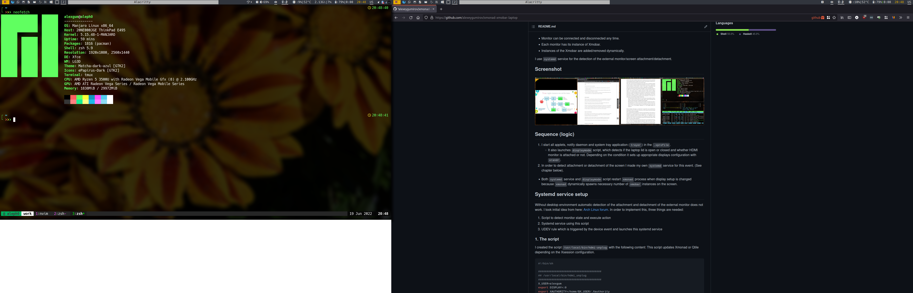

# Xmonad and Xmobar setup for laptop

Here I publish my Xmonad and Xmobar setup for the laptop.
Key features of this setup is ability of the proper dynamic monitor setup: laptop screen + second HDMI connected monitor.

- Monitor can be connected and disconnected any time.
- Each monitor has its instance of Xmobar.
- Instances of the Xmobar are added/removed dynamically.

I use `systemd` service for the detection of the external monitor/screen attachment/detachment.

## Screenshot



## Sequence (logic)

1. I start all applets, notify daemon and system tray application (`trayer`) in the `.xprofile`.
    - It also launches `displaymode` script, which detects if the laptop lid is open or closed and whether HDMI monitor is attached or not. Depending on the condition it sets up appropriate displays configuration with `xrandr`.
2. In order to detect attachment or detachment of the screen I made my own `systemd` service for this event. (See chapter below).
  - Both `systemd` service and `displaymode` script restart `xmonad` process when display setup is changed because `xmonad` dynamically spawns necessary number of `xmobar` instances on the screen.

## Systemd service setup

Without desktop environment automatic detection of the attachment and detachment of the external monitor does not work.
I took initial idea from here: [Arch Linux forum](https://bbs.archlinux.org/viewtopic.php?id=170294).
In order to implement this, three things are needed:

1. Script to detect monitor state and execute action
2. Systemd service using this script
3. UDEV rule which is triggered by the device event and launches this systemd service

### 1. The script

I created the script `/usr/local/bin/hdmi-unplug` with the following content:
This script updates Xmonad or Qtile depending on the Xsession configuration.

```sh
#!/bin/sh

######################################
## /usr/local/bin/hdmi_unplug
######################################
X_USER=alexgum
export DISPLAY=:0
export XAUTHORITY=/home/$X_USER/.Xauthority
export DBUS_SESSION_BUS_ADDRESS=unix:path=/run/user/1000/bus
HDMI_STATUS=$(cat /sys/devices/pci0000:00/0000:00:08.1/0000:05:00.0/drm/card0/card0-HDMI-A-1/status)
LID_STATE=$(cat /proc/acpi/button/lid/LID/state | cut -d':' -f2 | tr -d ' ')

connect()
{   
    case $1 in
        "open")
            # I don't want automatic desktop extension on the output.
            # I prefer manual switching to the desired mode.
            xrandr --output eDP --primary --auto --output HDMI-A-0 --off
            ;;
        "closed")
            xrandr --output eDP --off --output HDMI-A-0 --primary --auto
            if [ ! -z "$(pgrep -fa Xsession | grep qtile)" ]
            then
                qtile-cmd -o cmd -f restart 2> /dev/null
            fi
            if [ ! -z "$(pgrep -fa Xsession | grep xmonad)" ]
            then
                echo " " > /tmp/displaymode #to display icons on Xmobar
                echo "HDMI" >> /tmp/displaymode
                xmonad --restart
            fi
            nitrogen --restore
            ;;
    esac
}

disconnect(){
    xrandr --output eDP --primary --auto --output HDMI-A-0 --off
    if [ ! -z "$(pgrep -fa Xsession | grep qtile)" ]
    then
        qtile-cmd -o cmd -f restart 2> /dev/null
    fi
    if [ ! -z "$(pgrep -fa Xsession | grep xmonad)" ]
    then
        echo " " > /tmp/displaymode # to display icons on Xmobar
        echo "default" >> /tmp/displaymode
        xmonad --restart
    fi
    nitrogen --restore
}

if [ "${HDMI_STATUS}" = "disconnected" ]; then
    disconnect
elif [ "${HDMI_STATUS}" = "connected" ]; then
    connect "${LID_STATE}"
fi

exit
```

### 2. The Systemd service

Then I created `/etc/systemd/system/hdmi-unplug.service` file with the following content:

```text
[Unit]
Description=HDMI Monitor unplug

[Service]
Type=simple
RemainAfterExit=no
User=alexgum
ExecStart=/usr/local/bin/hdmi-unplug

[Install]
WantedBy=multi-user.target
```

### 3. UDEV rule

And, finally, UDEV rule `/etc/udev/rules.d/95-hdmi-unplug.rules`:

```text
# My rule to automatically unplug external HDMI monitor when disconnected
ACTION=="change", KERNEL=="card0", SUBSYSTEM=="drm", RUN+="/usr/bin/systemctl start hdmi-unplug.service"
```

## Xmonad.hs critical section

Full `xmonad.hs` configuration you can find [here](.xmonad/xmonad.hs). Here is just show essential part of the code.

I use `XMonad.Layout.IndependentScreens` to detect number of screens.
Then I put myLogHook in a separate definition (you can check it in the configuration file). It allows to make `main` part short and clean and I can easier redirect log to both `xmobar` pipes when they are open.

And then in the `main` function:

```
main = do
    nScreens <- countScreens
    if nScreens == 1
        then do 
            xmproc0 <- spawnPipe "xmobar -x 0 /home/alexgum/.config/xmobar/xmobarrc"
            xmonad $ docks defaults {
                    manageHook = manageDocks <+> namedScratchpadManageHook scratchpads <+> manageHook defaults
                    , layoutHook = avoidStruts $ layoutHook defaults
                    , logHook = myLogHook xmproc0
                    }
        else do
            xmproc0 <- spawnPipe "xmobar -x 0 /home/alexgum/.config/xmobar/xmobarrc"
            xmproc1 <- spawnPipe "xmobar -x 1 /home/alexgum/.config/xmobar/xmobarrc1"
            xmonad $ docks defaults {
                    manageHook = manageDocks <+> namedScratchpadManageHook scratchpads <+> manageHook defaults
                    , layoutHook = avoidStruts $ layoutHook defaults
                    , logHook = myLogHook xmproc0 >> myLogHook xmproc1
                    }
```

Each time when `xmobar` is restarted, it re-detects number of displays and spawns necessary number of bars.

The only exception is **mirror** mode (`xrandr --output eDP --primary --auto --output HDMI-A-0 --auto --same-as eDP`), then no `xmobar` restart is needed because I want to keep main screen `xmobar` being projected.
